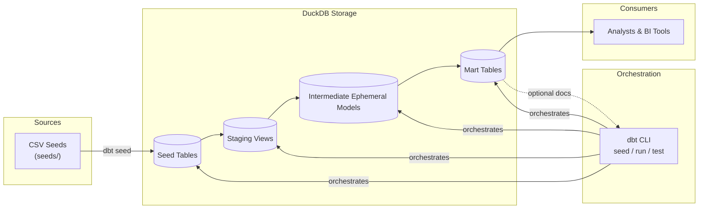

# ShopSmart E-commerce Analytics Pipeline Technical Design

## 1. Overview
This document defines the technical design for the ShopSmart analytics pipeline implemented with dbt and DuckDB. The pipeline transforms raw e-commerce activity captured in CSV seeds into curated marts that power revenue, customer, product, and marketing analytics. It reflects the reference implementation delivered in the dbt tutorial and provides the architectural decisions, model specifications, testing strategy, and operational guidance required to run the solution in development or production-like environments.

## 2. Goals & Non-Goals
- Deliver reproducible analytics datasets for self-service reporting and exploratory analysis.
- Standardize transformation logic for core business entities (customers, orders, products, marketing performance).
- Enforce basic data quality checks that prevent propagation of breaking changes from raw inputs.
- Document the pathway to production hardening (scheduling, monitoring, governance).
- Non-goal: Replace upstream transactional systems or implement real-time streaming ingestion. The scope is batch analytics on CSV-source data.

## 3. Stakeholders & Roles
- **Data Engineering**: Own dbt project structure, model implementation, and CI/CD.
- **Analytics Engineering**: Curate marts, define metrics, and manage tests/documentation.
- **Data Analysts**: Consume marts for dashboards and ad-hoc queries.
- **Platform/Infra**: Support storage, scheduling, and observability if deployed beyond local DuckDB.

## 4. Architecture Overview
- **Storage**: DuckDB files (`my_dbt.duckdb` for dev, `my_dbt_prod.duckdb` for prod) hold both seeds and model outputs.
- **Transformation Engine**: dbt-core orchestrates SQL transformations with environment-specific profiles.
- **Input Interface**: CSV seeds version-controlled under `seeds/`. Loaded via `dbt seed`.
- **Semantic Layers**: Staging views, intermediate ephemeral models, and materialized mart tables.
- **Execution Flow**: `dbt seed` → `dbt run` (staging → intermediate → marts) → `dbt test` → optional `dbt docs generate`.



### 4.1 Logical Data Flow
```
raw CSVs → staging views → intermediate ephemeral models → marts (core + marketing)
```
- Staging normalizes raw structure, applies type casting, and renames fields.
- Intermediate layer enriches with derived metrics and aggregations used across marts.
- Marts surface dimensional and fact tables aligned to business domains.

### 4.2 Environments
- **Development**: Local DuckDB file, manual `dbt run`. Uses profile target `dev` with 4 threads.
- **Production Blueprint**: DuckDB (or cloud warehouse) with automated orchestration. Profile target `prod` set to 8 threads for parallelism.

## 5. Source Data Inventory
| Source | Path | Description | Refresh | Notes |
| --- | --- | --- | --- | --- |
| Users | `seeds/raw_customers.csv` | Customer registration attributes. | Batch seed | Contains registration timestamps, geographic info. |
| Orders | `seeds/raw_orders.csv` | Order headers with customer, status, totals. | Batch seed | Primary key `order_id`; includes coupon usage. |
| Order Items | `seeds/raw_order_items.csv` | Line-level items associated with orders. | Batch seed | Contains product linkage, quantity, price, discounts. |
| Products | `seeds/raw_products.csv` | Product catalog metadata. | Batch seed | Includes category, brand, cost, price. |
| Categories | `seeds/raw_categories.csv` | Product category hierarchy. | Batch seed | Enables rollups across category tree. |

## 6. Transformation Design
### 6.1 Naming & Conventions
- Prefix `stg_` for staging, `int_` for intermediate, domain folders under `models/` enforce modularity.
- All timestamps normalized to UTC. Monetary values cast to numeric with two decimal precision.
- Surrogate keys formed with `dbt_utils.surrogate_key` where composites exist (e.g., order item grain).

### 6.2 Staging Layer (`models/staging/`)
| Model | Grain | Purpose | Key Outputs |
| --- | --- | --- | --- |
| `stg_ecommerce__users` | 1 row per user | Clean registration data, derive full name, normalize country/state codes. | `user_id`, `full_name`, `email`, `signup_date`, `country` |
| `stg_ecommerce__orders` | 1 row per order | Cast financial fields, derive order date, filter to completed/cancelled statuses. | `order_id`, `user_id`, `order_date`, `order_status`, `order_total`, `discount_total` |
| `stg_ecommerce__order_items` | 1 row per order item | Normalize quantities/prices, calculate extended revenue, line cost. | `order_item_id`, `order_id`, `product_id`, `quantity`, `unit_price`, `line_revenue`, `line_profit` |
| `stg_ecommerce__products` | 1 row per product | Join categories, expose dimensional attributes. | `product_id`, `product_name`, `brand`, `category_id`, `category_name`, `unit_cost`, `unit_price` |

Materialization: Views (default). Tagged `staging` for selective runs.

### 6.3 Intermediate Layer (`models/intermediate/`)
| Model | Grain | Purpose | Highlights |
| --- | --- | --- | --- |
| `int_customer_order_history` | 1 row per customer per order | Combine staged orders/items per user. | Computes order revenue, AOV, running totals used by `dim_customers`. |
| `int_product_performance` | 1 row per product per day | Aggregate sales metrics by product. | Derives `daily_revenue`, `daily_profit`, `orders_with_discount`. |

Materialization: Ephemeral. Enables reuse without persisting intermediate tables.

### 6.4 Mart Layer (`models/marts/`)
- **Core Domain (`models/marts/core/`)**
  - `dim_customers` (table): Customer master with lifetime metrics (total orders, total revenue, average order value, segment classification). Uses variables `high_value_customer_threshold` (default 1000) and `active_customer_days` (default 90) for segmentation.
  - `fct_orders` (table): Order-level fact including revenue, discount, fulfillment flags, derived profitability.
  - `fct_order_items` (table): Item-level fact enriched with product data, profit margin calculations, and discount indicators.
- **Marketing Domain (`models/marts/marketing/`)**
  - `marketing_performance` (table): Daily marketing view combining order revenue with campaign attribution fields and channel rollups.

All marts materialize as tables to support downstream BI tools and incremental rebuilds. A full refresh is expected after seed updates; incremental strategies can be introduced when upstream systems support CDC.

### 6.5 Dependencies & DAG
- Staging models depend on seeds via `ref('raw_*')` (dbt seeds automatically create references).
- `int_customer_order_history` references `stg_ecommerce__users`, `stg_ecommerce__orders`, and `stg_ecommerce__order_items`.
- `int_product_performance` references `stg_ecommerce__order_items` and `stg_ecommerce__products`.
- Marts reference the appropriate intermediate models plus staging where needed. DAG produces a layered dependency graph compatible with `dbt docs` lineage.

## 7. Configuration & Parameters
- `dbt_project.yml` defines folder-level materializations and tag hierarchy.
- Profile `my_first_project` manages DuckDB connections and thread counts.
- Variables defined in `dbt_project.yml`:
  - `start_date`: `'2023-01-01'` used by date filters (e.g., incremental seeds or KPI windows).
  - `high_value_customer_threshold`: `1000` controlling customer segment classification.
  - `active_customer_days`: `90` marking customers as active based on latest order recency.

## 8. Data Quality & Testing Strategy
- **Generic Tests**: Primary/unique key integrity (`unique`, `not_null`) on IDs across staging and marts.
- **Relationship Tests**: Ensure referential integrity between facts and dimensions (e.g., `fct_orders.user_id` → `dim_customers.user_id`).
- **Acceptance Tests**: Business rules such as non-negative revenue, discount thresholds, and valid order statuses.
- **Source Freshness**: Optional macros to monitor seed ingestion dates; recommended when seeds are refreshed externally.
- **CI/CD**: GitHub Actions workflow runs `dbt deps`, `dbt test` on PRs. Extend with `dbt build` to include full builds once data volume grows.

## 9. Performance Considerations
- DuckDB in-memory execution provides fast local runs; thread counts configured per environment.
- Materialized marts prevent repeated heavy aggregations for analysts.
- Intermediate ephemeral models avoid writing transient data while keeping SQL DRY.
- For larger datasets, consider partitioned materializations, incremental models with `is_incremental()`, and pushing storage to a warehouse (BigQuery, Snowflake, Redshift).

## 10. Operational Runbook
- **Manual Execution**:
  1. `dbt seed`
  2. `dbt run`
  3. `dbt test`
  4. `dbt docs generate` (optional)
- **Scheduled Pipeline**: Orchestrate via GitHub Actions, Airflow, Dagster, or dbt Cloud; trigger `dbt build` nightly.
- **Monitoring**: Capture run artifacts (`target/`), review `run_results.json`. Integrate dbt artifacts into observability stacks (e.g., Elementary, Monte Carlo) for alerting.
- **Rollback Strategy**: Since DuckDB stores results in a single file, keep daily snapshots or rely on git-tagged seeds for restoration.

## 11. Security & Compliance
- CSV seeds may contain customer PII (emails, addresses). Restrict repository access and consider masking or tokenization for shared environments.
- DuckDB files should be stored in encrypted storage with access logging when used beyond local development.
- Secrets (if migrating to external warehouses) belong in `profiles.yml` with environment variable substitution, not checked into version control.

## 12. Assumptions & Dependencies
- Source CSVs remain schema-stable; schema drift requires updates to staging models and tests.
- Timestamps are consistent and in UTC or include timezone offsets convertible to UTC.
- Discount and tax calculations are trusted as provided in the raw data.
- Marketing attribution fields are available in orders data; external campaign systems are out of scope.

## 13. Risks & Mitigation
- **Risk**: Seed files become stale or diverge from production reality. **Mitigation**: Establish refresh cadence and data contracts with upstream owners.
- **Risk**: DuckDB file corruption. **Mitigation**: Automate backups, include checksum validation in CI.
- **Risk**: Data volume growth overwhelms local resources. **Mitigation**: Plan migration path to a cloud warehouse with similar dbt structure.
- **Risk**: Segmentation thresholds (`high_value_customer_threshold`, `active_customer_days`) misaligned with business expectations. **Mitigation**: Parameterize via variables and document change control.

## 14. Future Enhancements
- Incremental models for order and item facts leveraging `start_date` boundary.
- Snapshotting slowly changing dimensions (customer attributes) with dbt snapshots.
- Metric layer integration using dbt Semantic Layer or MetricFlow for consistent KPI definitions.
- Real-time ingestion using streaming tools (Kafka, Fivetran) feeding a warehouse; adapt staging to incremental idioms.
- Expanded testing (row-count assertions, anomaly detection) and lineage documentation.

## 15. Appendix
- **Sample Queries**:
  ```sql
  -- Top customers by lifetime value
  SELECT full_name, lifetime_value, total_orders, customer_segment
  FROM dim_customers
  ORDER BY lifetime_value DESC
  LIMIT 10;

  -- Daily revenue trends with marketing context
  SELECT order_date, total_revenue, total_orders, avg_order_value, marketing_channel
  FROM marketing_performance
  ORDER BY order_date DESC
  LIMIT 14;

  -- Product profitability view
  SELECT product_name, brand, total_revenue, line_profit, profit_margin_pct
  FROM fct_order_items
  WHERE total_revenue > 0
  ORDER BY line_profit DESC
  LIMIT 15;
  ```
- **Related Documentation**:
  - `dbt_tutorial.md` for step-by-step setup guidance.
  - `README.md` for repository-level instructions and dependencies.
